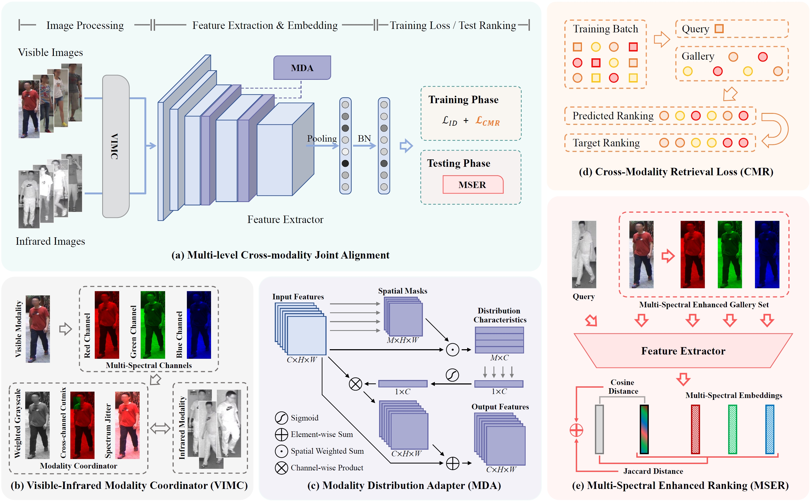

# Bridging the Gap: Multi-level Cross-modality Joint Alignment for Visible-infrared Person Re-identification

By [Tengfei Liang](https://scholar.google.com/citations?user=YE6fPvgAAAAJ),  [Yi Jin](https://scholar.google.com/citations?user=NQAenU0AAAAJ),  [Wu Liu](https://scholar.google.com/citations?user=rQpizr0AAAAJ),  [Tao Wang](https://scholar.google.com/citations?user=F3C5oAcAAAAJ),  [Songhe Feng](https://scholar.google.com/citations?user=K5lqMYgAAAAJ),  [Yidong Li](https://scholar.google.com/citations?user=3PagRQEAAAAJ).

This repository is an official implementation of the paper [Bridging the Gap: Multi-level Cross-modality Joint Alignment for Visible-infrared Person Re-identification](https://ieeexplore.ieee.org/abstract/document/10472470). [`IEEEXplore`](https://ieeexplore.ieee.org/abstract/document/10472470) [`Google Drive`](https://drive.google.com/file/d/19-2f-gTj3P9tV-YhabtVpXSgShxFrGrs/view?usp=sharing)

*Notes:*

This repository offers the complete code of the entire method, featuring a well-organized directory structure and detailed comments, facilitating the training and testing of the model. 
It is hoped that this can serve as a new baseline for cross-modal visible-infrared person re-identification.


## Abstract

Visible-Infrared person Re-IDentification (VI-ReID) is a challenging cross-modality image retrieval task that aims to match pedestrians' images across visible and infrared cameras. 
To solve the modality gap, existing mainstream methods adopt a learning paradigm converting the image retrieval task into an image classification task with cross-entropy loss and auxiliary metric learning losses. 
These losses follow the strategy of adjusting the distribution of extracted embeddings to reduce the intra-class distance and increase the inter-class distance. 
However, such objectives do not precisely correspond to the final test setting of the retrieval task, resulting in a new gap at the optimization level. 
By rethinking these keys of VI-ReID, we propose a simple and effective method, the Multi-level Cross-modality Joint Alignment (MCJA), bridging both the modality and objective-level gap. 
For the former, we design the Visible-Infrared Modality Coordinator in the image space and propose the Modality Distribution Adapter in the feature space, effectively reducing modality discrepancy of the feature extraction process. 
For the latter, we introduce a new Cross-Modality Retrieval loss. 
It is the first work to constrain from the perspective of the ranking list in the VI-ReID, aligning with the goal of the testing stage. 
Moreover, to strengthen the robustness and cross-modality retrieval ability, we further introduce a Multi-Spectral Enhanced Ranking strategy for the testing phase. 
Based on the global feature only, our method outperforms existing methods by a large margin, achieving the remarkable rank-1 of 89.51% and mAP of 87.58% on the most challenging single-shot setting and all-search mode of the SYSU-MM01 dataset. 
(For more details, please refer to [the original paper](https://ieeexplore.ieee.org/abstract/document/10472470))

<br/>
<div align="center">
  

  Fig. 1: Overall architecture of the proposed MCJA model.
</div>


## Requirements

The code of this repository is designed to run on a single GPU. 
Here are the Python packages and their corresponding versions during the execution of our experiments:

- Python 3.8
- apex==0.1
- numpy==1.21.5
- Pillow==8.4.0
- pytorch_ignite==0.2.1
- scipy==1.7.3
- torch==1.8.1+cu111
- torchsort==0.1.9
- torchvision==0.9.1+cu111
- yacs==0.1.8

*Notes:*
When installing the 'apex' package, please refer to its [official repository - apex](https://github.com/NVIDIA/apex).

*P.S.* Higher or Lower versions of these packages might be supported. 
When attempting to use a different version of PyTorch, please be mindful of the compatibility with pytorch_ignite, torchsort, etc.


## Dataset & Preparation

During the experiment, we evaluate our proposed method on publicly available datasets, SYSU-MM01 and RegDB, which are commonly used for comparison in VI-ReID.
Please download the corresponding datasets and modify the path of the data_root folder in [configs/default/dataset.py](./configs/default/dataset.py).


## Experiments

Our [main.py](./main.py) supports both training and testing as well as testing only.

### Train

During the training process, executing the following command allows for the training and evaluation of MCJA models on the SYSU-MM01 and RegDB datasets:

```bash
python main.py --cfg configs/SYSU_MCJA.yml --gpu 0 --seed 8 --desc MCJA
```

```bash
python main.py --cfg configs/RegDB_MCJA.yml --gpu 0 --seed 8 --desc MCJA
```

### Test

When conducting tests only, set 'test_only' to true in the 'XXXX.yml' configuration file and specify the path for loading the model in the 'resume' setting. 
Then, execute the same command as mentioned above to complete the testing and evaluation:

```bash
python main.py --cfg configs/SYSU_MCJA.yml --gpu 0 --desc MCJA_test_only
```

```bash
python main.py --cfg configs/RegDB_MCJA.yml --gpu 0 --desc MCJA_test_only
```

*Notes:*
The '--seed' and '--desc' of [main.py](./main.py) are optional. 
The former is used to add a suffix description to the current run, while the latter controls the random seed for this experiment.


## Citation
If you find MCJA useful in your research, please kindly cite this paper in your publications:
```bibtex
@article{TCSVT24_MCJA,
    author  = {Liang, Tengfei and Jin, Yi and Liu, Wu and Wang, Tao and Feng, Songhe and Li, Yidong},
    title   = {Bridging the Gap: Multi-level Cross-modality Joint Alignment for Visible-infrared Person Re-identification}, 
    journal = {IEEE Transactions on Circuits and Systems for Video Technology}, 
    pages   = {1-1},
    year    = {2024},
    doi     = {10.1109/TCSVT.2024.3377252}
}
```


## Related Repos
Our repository builds upon the work of others, and we extend our gratitude for their contributions. 
Below is a list of some of these works:

- AGW - https://github.com/mangye16/Cross-Modal-Re-ID-baseline
- MPANet - https://github.com/DoubtedSteam/MPANet


## License

This repository is released under the MIT license. Please see the [LICENSE](./LICENSE) file for more information.
